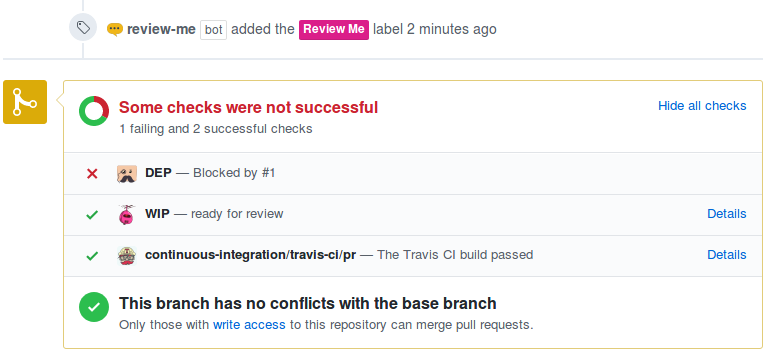

# Review Me

[](https://travis-ci.org/ahmed-taj/probot-review-me)

A GitHub App built with [probot](https://github.com/probot/probot) that helps you to decide when a pull request is ready for review based on its statuses.

## Why?

It's not always necessary for all status checks to pass, sometimes we need more than ✕ or ✓ to determine if a pull request is ready for review or not.

## How it works

The app listens to pull request statuses and adds a review label (`[Review me]` by default) if all statuses matched. Otherwise, it removes the label.



That way, maintainers/reviewers can filter pull requests to look only into ready ones.

## Usage

1. **[Configure the GitHub App](https://github.com/apps/review-me)**
2. Create `.github/review-me.yml` based on the following template
3. It will start to listen to pull request statuses and update them accordingly.

A `.github/review-me.yml` file is required to enable the app:

```yaml
# List of contexts (i.e. apps) and their corresponding statuses
when:
  # Allowed statuses are:
  #
  #   - success
  #   - failure
  #   - pending
  #   - error
  continuous-integration/travis-ci/pr: success
  wip: success

# Override default label (optional)
label: Review Me
```

## Development

```
# Install dependencies
npm install

# Run the bot
npm start
```

## Deployment

See [docs/deploy.md](docs/deploy.md) if you would like to run your own instance of this app.

## You might also like

* **[commitlint-bot](https://github.com/ahmed-taj/commitlint-bot):** A GitHub App that runs commitlint for you!
* **[DEP](https://github.com/ahmed-taj/dep):** A Github App that helps managing PR dependencies

## License

MIT © [Ahmed T. Ali](https://github.com/ahmed-taj)
